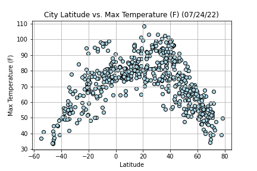

# python-api-challenge
# WeatherPy and VacationPy

## Context
It's vacation time! This assingment will demonstrate skills of what I've learned about Python requests, APIS, and JSON traverals to answer a fundamental question: "What's the weather like as we approach the equator?". Show data to prove this theory. 

## Folders:

1. [WeatherPy] - contains WeatherPy.ipynb. Calculations of weather forecasts based on weather criterias of cities. 

2. [VacationPy] - contains VacationPy.ipynb. Calculates and displays interactive maps of vacation spots based on personal weather criterias. 

3. [output_data] - contains cities.csv and .png files of data plots

# Summary and Analysis

1. In this scatter plot, it is proven visually any cities furthest away from the equator will have a lower max temperature. Cities closer to the equater will have a greater max temperature. When comparing the linear regression of both northern and southern hemisphere, the relationship between predeiciton and data is strong. The r-value is approximately 0.5. 

2. Plots comparing Latitudes to wind speed, humidity, and cloudiness have no correlation whatsoever. Its data cannot be forcasted by the linear equation. The r-value for those plots are approximately 0. 

3. According to the weather forecast pulled on July 24, 2022 the percentage of humidity are greater than 60% in most cities. The wind speed for most cities for that day are forcasted less than 10 mph. 

*** Please be advised. Running the notebook will generate a new list of cities. Data will look different than referenced pictures in "output_data" Folder if clicking "run" again. ***

